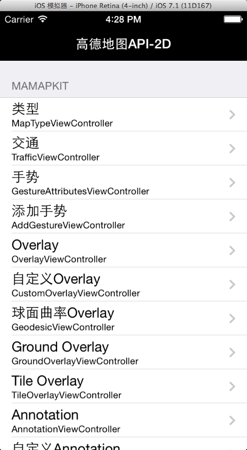
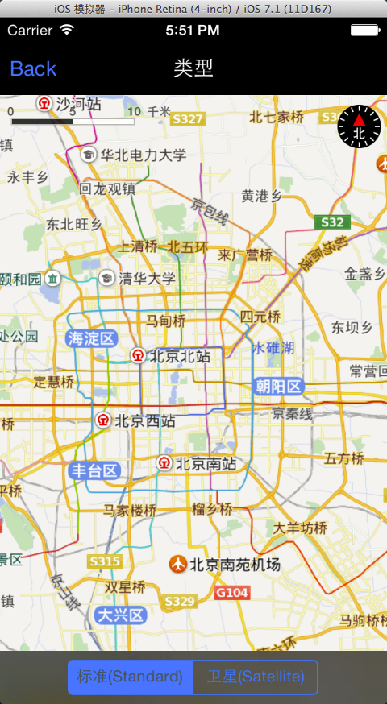
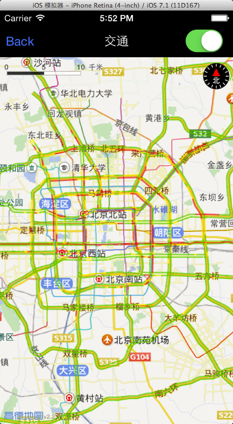
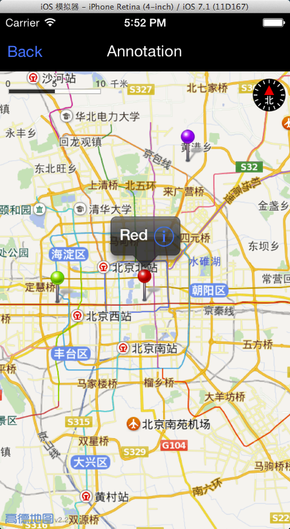
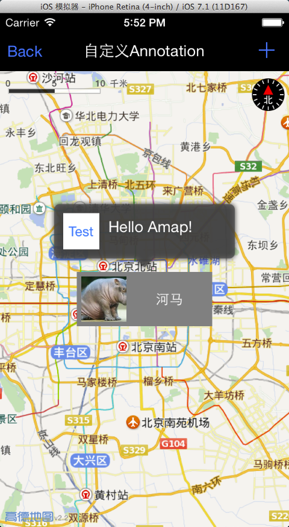
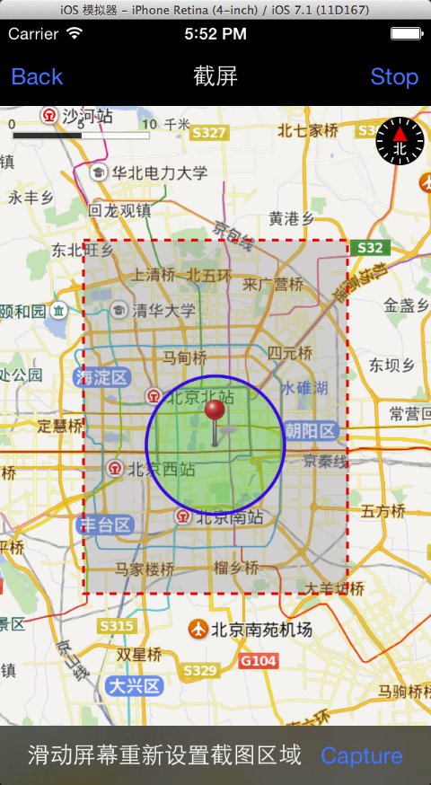

iOS_2D_Demo
===========

高德 iOS 2D SDK 官方Demo

### 前述

- [高德官方网站申请key](http://id.amap.com/?ref=http%3A%2F%2Fapi.amap.com%2Fkey%2F).
- 阅读[参考手册](http://api.amap.com/Public/reference/iOS%20API%20v2_2D/).
- 如果有任何疑问也可以发问题到[官方论坛](http://bbs.amap.com/forum.php?gid=1).

### 架构

##### Controllers
- `<UIViewController>`
  * `MainViewController`
  * `BaseMapViewController` 地图基类
    - `MapTypeViewController` 地图类型
    - `TrafficViewController` 实时交通
    - `GestureAttributesViewController` 手势屏蔽
    - `AddGestureViewController` 添加手势
    - `OverlayViewController` 基础overlay
    - `CustomOverlayViewController` 自定义overlay
    - `GeodesicViewController` 大地曲线
    - `GroundOverlayViewController` ground overlay
    - `TileOverlayViewController` tile overlay
    - `AnnotationViewController` 基础annotationView
    - `CustomAnnotationViewController` 自定义annotationView
    - `AnimatedAnnotationViewController` 动画annotationView
    - `UserLocationViewController` 定位
    - `ScreenShotViewController` 截屏
    - `CustomUserLocationViewController` 自定义定位annotationView

##### Models

* `Conform to <MAAnnotation>`
  - `AnimatedAnnotation`
  - `BusStopAnnotation` 
  - `GeocodeAnnotation`
  - `POIAnnotation`
  - `ReGeocodeAnnotation`
  
* `Conform to <MAOverlay>`
  - `CustomOverlay`
  - `LineDashPolyline`

##### Views

* `MAAnnotationView`
  - `AnimatedAnnotationView`
  - `CustomAnnotationView`
* `MAOverlayRenderer`
  - `CustomOverlayRenderer`
* `CustomCalloutView`

### 截图效果

### 在线安装Demo

* `手机扫描如下二维码直接安装`

* `手机上打开地址:<http://fir.im/amap2d>`
